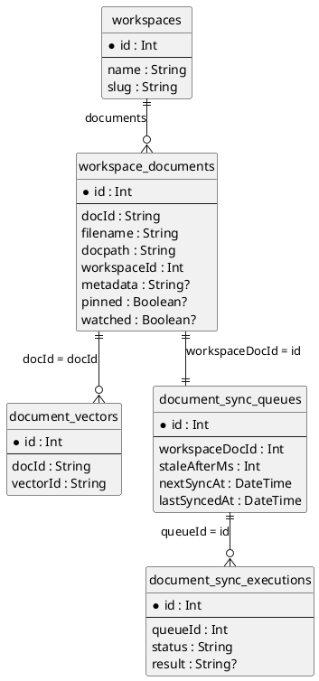

# Anything-LLM 中与 Document 相关的数据结构与关系

本文梳理 `workspace_documents` 及其相关的 Prisma 模型和 Node 端 `server/models/documents.js` 的核心职责，帮助理解文档在系统中的完整链路。

---

## 一、核心实体与字段

### 1. `workspaces`

> 文档所属的工作区。

Prisma 定义（节选）：

```prisma
model workspaces {
  id            Int                  @id @default(autoincrement())
  name          String
  slug          String               @unique
  ...
  documents     workspace_documents[]
}
```

- **关键字段**
  - `id`: 主键
  - `name`: 工作区名称
  - `slug`: 唯一 slug，用来作为向量库的 namespace（`workspace.slug`）
- **与文档关系**
  - 一对多：一个 workspace 下可以有多条 `workspace_documents`

---

### 2. `workspace_documents`

> 核心的“文档索引表”：记录每个工作区中的文档及其元数据。

Prisma 定义：

```prisma
model workspace_documents {
  id                   Int                   @id @default(autoincrement())
  docId                String                @unique
  filename             String
  docpath              String
  workspaceId          Int
  metadata             String?
  pinned               Boolean?              @default(false)
  watched              Boolean?              @default(false)
  createdAt            DateTime              @default(now())
  lastUpdatedAt        DateTime              @default(now())
  workspace            workspaces            @relation(fields: [workspaceId], references: [id])
  document_sync_queues document_sync_queues?
}
```

- **关键字段含义**

  - `id`: 数据库主键，其他表用它做外键（如 `document_sync_queues.workspaceDocId`）。
  - `docId`: 逻辑文档 ID，**连接向量库和 `document_vectors` 的关键字段**，全局唯一。
  - `filename`: 文件名（当前实现用 `path.split("/")[1]`，注意只取第二段）。
  - `docpath`: 文件系统中的路径（`fileData` 读取实际内容依赖它）。
  - `workspaceId`: 所属 workspace。
  - `metadata`: JSON 字符串，内部包含文档元数据，例如：
    - `title`
    - `chunkSource`：形如 `type://source`，用于记录文档来源（github/confluence/本地等）。
  - `pinned` / `watched` / `lastUpdatedAt`: UI 交互或业务层使用的状态字段。

- **在 Node 侧 `Document` 模型中的典型方法**
  - 查询：`forWorkspace`, `get`, `where`, `count`
  - 更新：`update`（只允许更新 `pinned`, `watched`, `lastUpdatedAt`）
  - 删除：`delete`, `_updateAll`
  - 内容读取：`content(docId)`, `contentByDocPath(docPath)`
  - 类型/来源解析：`parseDocumentTypeAndSource(document)`

---

### 3. `document_vectors`

> 文档切片在向量库中的“本地映射表”。

Prisma 定义：

```prisma
model document_vectors {
  id            Int      @id @default(autoincrement())
  docId         String
  vectorId      String
  createdAt     DateTime @default(now())
  lastUpdatedAt DateTime @default(now())
}
```

- **作用**
  - `docId`: 对应 `workspace_documents.docId`。
  - `vectorId`: 存储在向量库中的向量标识（具体含义依赖向量 DB 实现）。
- **在 `Document` 中的使用**
  - 删除文档时：
    ```js
    prisma.document_vectors.deleteMany({ where: { docId: document.docId } });
    ```
    确保 DB 中该文档的所有向量记录一并被清理。

---

### 4. `document_sync_queues` & `document_sync_executions`

> 用于“文档同步/重抓取”的任务队列和执行记录。

Prisma 定义：

```prisma
model document_sync_queues {
  id             Int                        @id @default(autoincrement())
  staleAfterMs   Int                        @default(604800000) // 7 days
  nextSyncAt     DateTime
  createdAt      DateTime                   @default(now())
  lastSyncedAt   DateTime                   @default(now())
  workspaceDocId Int                        @unique
  workspaceDoc   workspace_documents?       @relation(fields: [workspaceDocId], references: [id], onDelete: Cascade)
  runs           document_sync_executions[]
}

model document_sync_executions {
  id        Int                  @id @default(autoincrement())
  queueId   Int
  status    String               @default("unknown")
  result    String?
  createdAt DateTime             @default(now())
  queue     document_sync_queues @relation(fields: [queueId], references: [id], onDelete: Cascade)
}
```

- **`document_sync_queues`**

  - 每条记录对应一个 `workspace_documents.id`（`workspaceDocId` 唯一）。
  - 用来计划/记录“下一次需要同步的时间”等：
    - `staleAfterMs`: 过期时间（默认 7 天）。
    - `nextSyncAt`: 下次该文档需要重新抓取/同步的时间。
    - `lastSyncedAt`: 上次成功同步时间。

- **`document_sync_executions`**
  - 记录每次同步执行的结果：
    - `queueId`: 指向 `document_sync_queues.id`。
    - `status`: 执行状态（成功/失败/unknown 等）。
    - `result`: 文本形式的执行结果或错误信息。

> 这一套是 **“定期刷新远程文档（例如 GitHub/Confluence）”的调度层**，和文档本体通过 `workspaceDocId → workspace_documents.id` 关联。

---

## 二、Node 侧 `Document` 对象的核心逻辑

文件：`server/models/documents.js`

### 1. 新增/嵌入文档：`addDocuments`

**流程概要：**

1. 传入：
   - `workspace` 对象
   - `additions`: 文档路径数组
   - 可选 `userId`
2. 对每个 `path`：
   - `fileData(path)` 解析文件，得到：`{ pageContent, ...metadata }`。
   - 生成 `docId = uuidv4()`。
   - 组装待插入 `workspace_documents` 记录：
     ```js
     const newDoc = {
       docId,
       filename: path.split("/")[1],
       docpath: path,
       workspaceId: workspace.id,
       metadata: JSON.stringify(metadata),
     };
     ```
   - 调用向量库：
     ```js
     VectorDb.addDocumentToNamespace(workspace.slug, { ...data, docId }, path);
     ```
   - 如果 `vectorized` 失败：记录错误和失败的文件名。
   - 如果成功：写入 `workspace_documents`。
3. 发送埋点：`Telemetry.sendTelemetry("documents_embedded_in_workspace", ...)`。
4. 记录事件：`EventLogs.logEvent("workspace_documents_added", ...)`。

**本质：**

- 将磁盘/远程文件 → 解析成文本 + 元数据 → 嵌入向量库 → 记录到 `workspace_documents` 中。

---

### 2. 删除文档：`removeDocuments`

流程：

1. 通过 `docpath` + `workspace.id` 找到对应 `workspace_documents` 记录：
   ```js
   const document = await this.get({
     docpath: path,
     workspaceId: workspace.id,
   });
   ```
2. 使用 `document.docId` 从向量库删除：
   ```js
   VectorDb.deleteDocumentFromNamespace(workspace.slug, document.docId);
   ```
3. DB 层删除：
   - `workspace_documents.delete({ where: { id: document.id, workspaceId: workspace.id } })`
   - `document_vectors.deleteMany({ where: { docId: document.docId } })`
4. 记录事件 `workspace_documents_removed`。

**关键点：**

- 通过 `docId` 将 DB 记录和向量库中的向量绑定在一起，删除时需要同时清理两端。
- 由于 `document_sync_queues.workspaceDoc` 设置了 `onDelete: Cascade`，删除 `workspace_documents` 会级联删除对应的同步队列和执行记录。

---

### 3. 文档内容访问：`content` / `contentByDocPath`

- `content(docId)`：

  1. 通过 `docId` 从 `workspace_documents` 查出记录，获取 `docpath`。
  2. 使用 `fileData(docpath)` 再次从磁盘读取文件。
  3. 返回 `{ title: data.title, content: data.pageContent }`。

- `contentByDocPath(docPath)`：
  - 直接根据路径 `fileData(docPath)` 读取并返回同样结构。

**说明：**

- 数据库中不保存文档全文，只保存路径和 metadata。
- 实际文本内容完全依赖文件系统和 `fileData` 逻辑。

---

### 4. 文档来源解析：`parseDocumentTypeAndSource` + `_stripSource`

- `parseDocumentTypeAndSource(document)`：

  1. `safeJsonParse(document.metadata, null)` 得到 `metadata`。
  2. 从 `metadata.chunkSource` 中解析 `type` 与 `source`：
     ```js
     const idx = metadata.chunkSource.indexOf("://");
     const [type, source] = [
       metadata.chunkSource.slice(0, idx),
       metadata.chunkSource.slice(idx + 3),
     ];
     ```
  3. 调用 `_stripSource(source, type)` 做隐私处理。

- `_stripSource(sourceString, type)`：
  - 对于 `confluence` / `github` 类型：
    - 使用 `new URL(sourceString)`，然后 `url.search = ""` 清空 query 部分，以防 log 中泄露编码参数。
  - 其他类型：原样返回。

**用途：**

- 将 metadata 中原始的 `chunkSource` 拆成可读的 `type` + `source`，同时覆盖日志/展示时的数据脱敏需求。

---

### 5. API 帮助函数：`api.uploadToWorkspace`

- 只给后端 `/v1/documents/upload` 使用，不对前端暴露。
- 参数：
  - `wsSlugs`: 逗号分隔的 workspace slug 字符串。
  - `docLocation`: 文档上传到服务器后的路径。
- 流程：

  1. 解析 `wsSlugs` 为 slug 数组。
  2. 通过 `Workspace.where({ slug: { in: slugs } })` 找到所有目标工作区。
  3. 对每个 workspace **顺序** 调用：

     ```js
     Document.addDocuments(workspace, [docLocation]);
     ```

     顺序处理是为了避免：

     - 大文档并发多次嵌入导致重复工作；
     - 首次嵌入后可复用缓存，使得后续工作区嵌入更快。

---

## 三、整体关系图（文字示意）

可以把所有与文档相关的结构抽象成如下关系：

```text
[workspaces]
   ├── id
   └── slug  <----------------------+
                                     \
                                      \
                                       v   (向量库 namespace)
                            Vector DB Namespace: workspace.slug
                                       ^
                                      /
                                     /
[workspace_documents]                /
   ├── id (PK)  --------------------+--- [document_sync_queues.workspaceDocId]
   ├── docId (unique) -------------+---- [document_vectors.docId]
   ├── filename
   ├── docpath  --(fileData)-> 文件系统中的实际文件
   ├── workspaceId ----> [workspaces.id]
   └── metadata (JSON: title, chunkSource, ...)

[document_vectors]
   ├── id
   ├── docId --------------------------> [workspace_documents.docId]
   └── vectorId  ----(映射)----> 向量库中该 chunk 的 ID

[document_sync_queues]
   ├── id
   ├── workspaceDocId ----------------> [workspace_documents.id]
   ├── staleAfterMs / nextSyncAt / lastSyncedAt
   └── runs: [document_sync_executions[]]

[document_sync_executions]
   ├── id
   ├── queueId -----------------------> [document_sync_queues.id]
   ├── status
   └── result
```

**新增文档链路（简化）：**

```text
文件(磁盘/远程) --fileData()--> pageContent + metadata
      |
      v
向量库.addDocumentToNamespace(workspace.slug, { ...data, docId }, path)
      |
      v
插入 DB: [workspace_documents] (docId, docpath, workspaceId, metadata)
      |
      v
(可选) 创建/更新 [document_sync_queues] 以便后续同步
```

**删除文档链路（简化）：**

```text
找到 [workspace_documents] by (docpath, workspaceId)
      |
      +--> VectorDb.deleteDocumentFromNamespace(workspace.slug, docId)
      |
      +--> DELETE FROM [workspace_documents] by id
      |
      +--> DELETE FROM [document_vectors] WHERE docId = ?
      |
      +--> (ON DELETE CASCADE) 自动删关联的 [document_sync_queues] & [document_sync_executions]
```

---

## 四、需要重点关注的坑点与注意事项

1. **`metadata.chunkSource` 的格式约定**

   - 解析逻辑假设格式为 `type://source`，使用 `indexOf("://")` 进行拆分。
   - 若调整 `fileData` 或 metadata 结构，要确保：
     - `chunkSource` 必须存在。
     - 格式兼容 `type://...`，否则 `parseDocumentTypeAndSource` 可能报错或解析出错。

2. **`docId` 与向量库的一致性**

   - 向量库添加/删除、`document_vectors` 表和 `workspace_documents` 都通过 `docId` 关联。
   - 任何脚本或手动修改 `docId`，都可能导致：
     - 无法正确删除向量；
     - 向量库中残留“脏数据”。

3. **`filename` 的截取方式**

   - 当前用 `path.split("/")[1]`，如果路径层级较深，例如 `hotdir/foo/bar.pdf`，得到的是 `foo` 而不是 `bar.pdf`。
   - 如果后续需要展示真实文件名，可能要根据业务调整为 `path.split("/").pop()`。

4. **`update` 的字段白名单**

   - `Document.writable = ["pinned", "watched", "lastUpdatedAt"]`。
   - 通过 `Document.update(id, data)` 只能修改上述字段，其它字段会被忽略并返回 `"No valid fields to update!"`。
   - 若希望通过统一接口修改 `metadata` 等，需要显式扩展 `writable` 或增加专用更新方法。

5. **内容读取依赖文件仍然存在**

   - DB 中不存全文，`content` 与 `contentByDocPath` 都依赖磁盘上的实际文件。
   - 如果文件被外部删除或移动，`fileData` 会失败，调用 `content` 可能抛错或返回不完整数据。

6. **嵌入顺序与性能**
   - `addDocuments` 和 `api.uploadToWorkspace` 目前都是顺序处理：
     - 优点：避免大文档并发重复嵌入，也便于使用缓存。
     - 缺点：多个 workspace 同时写入时速度相对较慢。
   - 如需并行化，需要额外设计幂等机制（防重复 embed）和资源限流策略。

---

## 五、总结

- **`workspace_documents`**：业务侧的“文档主表”，管理文档在各 workspace 中的索引、路径和元信息。
- **`document_vectors`**：将文档 `docId` 与向量库中具体向量 ID 关联，方便批量删除和排查问题。
- **`document_sync_queues` / `document_sync_executions`**：面向远程数据源的定期同步/重抓取调度与执行记录层。
- **`workspaces`**：承载文档归属和向量库 namespace（`slug`），是检索和嵌入时的上层隔离单元。

理解以上结构，有助于：

- 排查某个文档检索不到/嵌入失败的问题；
- 设计新的文档来源（如接第三方知识库）时，复用现有同步/嵌入链路；
- 编写迁移脚本、清理脚本时，确保 DB 与向量库的一致性。

---

## 六、PlantUML ER 图


